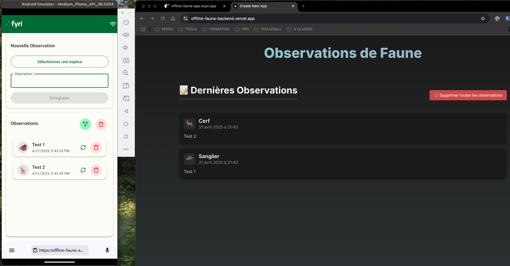

# Offline Fauna App

## 📋 Description

A mobile application for managing fauna data offline.

Frontend WebApp: https://offline-fauna-app.expo.app

Backend WebApp: https://offline-fauna-backend.vercel.app/

## 🚀 Features

- Offline data management
- Real-time synchronization
- User-friendly interface

## 📸 Screenshots

### App mobile



### App web


## 🛠️ Tech Stack

### Frontend

Repo: https://github.com/ericledonge/offline-fauna-app

- **Frontend**: React Native with Expo
- **State Management**: Zustand
- **Server Data Management**: Apollo Client
- **Navigation**: Expo Router
- **UI Components**: React Native Paper
- **Hosting Web App**: EAS

### Backend

Repo: https://github.com/ericledonge/offline-fauna-backend

- **Backend**: Nextjs
- **Database**: Neon
- **Hosting Web App**: Vercel

## 🛠️ Installation

```bash
npm install
npm start
```
